# Raven Framework (alpha v0.1)

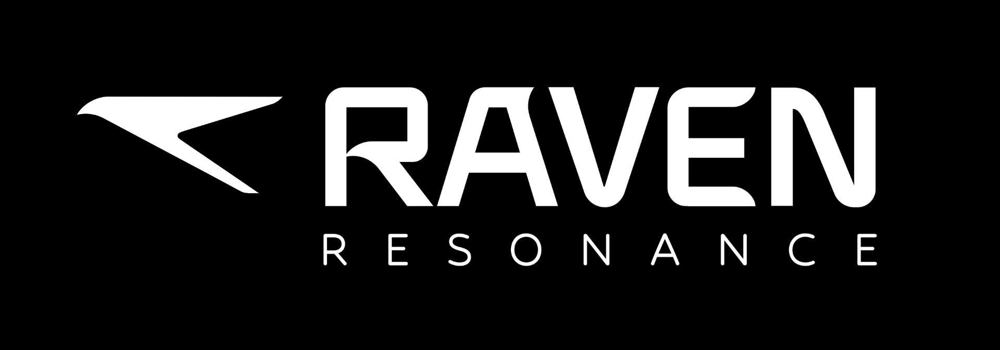


A comprehensive UI framework and API for building gaze-based applications for Raven Glass. Take full advantage of the extensive sensor suite on Raven Glass including eye tracking, cameras, IMUs, microphones, and more. The framework features gaze-based interactions like buttons and scrolling with eyes, along with voice input, media handling, AI integration, and many more modern UI components—all built on Python for easy development.

> If this is your **first Raven application**, check out the [Raven Starter Project](https://github.com/RavenResonance/raven-starter-project) repository.

The framework is being developed by Raven Resonance, a small team building AR glasses for all-day wear. [Raven Glass v1](https://raven.computer/) hardware will be out soon and runs RavenOS, a Linux-based operating system. This repo contains a preview of Raven Framework and is the first part of the Raven SDK. We would love to hear your feedback in our [Discord community](https://raven.computer/s/discord)!


## Table of Contents

- [Installation](#installation)
- [Core App Components](#core-app-components)
- [UI Widgets](#ui-widgets)
  - [Layout](#layout)
  - [Components](#components)
  - [Cards](#cards)
- [Peripherals](#peripherals)
- [Helpers](#helpers)
- [Designing for Raven OS](#designing-for-raven-os)
- [Examples](#examples)
- [Building Apps with AI](#building-apps-with-ai)

## Installation

### Prerequisites

- Python >=3.10

### Install from Source

```bash
git clone https://github.com/RavenResonance/raven-framework.git 
cd raven-framework
pip install -e .
```

**Note:** You might need to use `pip3 install -e .` instead of `pip install -e .` depending on your system.

**Note:** Some components may have special installation requirements. See component documentation for details (e.g., Speaker requires `audio-simulator` optional dependency for simulator mode).

## Core App Components

### Raven App

The standard required base class for all Raven applications. Provides the main application container where widgets are added.

```python
from raven_framework.core.raven_app import RavenApp

class MyApp(RavenApp):
    def __init__(self):
        super().__init__()
        self.app.add(button, x=0, y=10)
        self.minimize()
```

### Run App

The main entry point for running Raven applications. Provides application execution and deployment functionality.

```python
from raven_framework.core.run_app import RunApp

if __name__ == "__main__":
    RunApp.run(
        lambda: MyApp(),
        app_id="",
        app_key=""
    )
```

Use `python main.py` (or `python3 main.py`) to run on desktop simulator, and `python main.py deploy` (or `python3 main.py deploy`) to run on Raven Glass. Make sure you input app ID and key for deployment; simulator can work without it.

Note: To close an app, use the home icon in the top right corner.

## UI Widgets

### Layout

#### Container

A base container widget to organize layout.

```python
from raven_framework.components.container import Container
```

Simple container:
```python
container = Container()
```

Container with fixed size:
```python
container = Container(width=640, height=640)
```

Container with inner margins:

Uniform margin (all sides):
```python
container = Container(inner_margin=20)
```

Horizontal and vertical margin (horizontal, vertical):
```python
container = Container(inner_margin=(30, 10))
```

Individual margins (left, top, right, bottom):
```python
container = Container(inner_margin=(20, 10, 20, 10))
```

Adding widgets to container:

Simple adding (vertical stacking by default):
```python
container = Container()
container.add(button)
```

Adding with absolute positioning:
```python
container = Container()
container.add(text_box, x=100, y=200)
```

**Frequently used params:** `background_color` (str, hex code), `background_image` (str, path of image), `corner_radius` (int), `border_width` (int), `border_color` (str, hex code), `width` (int), `height` (int), `inner_margin` (int), `spacing` (int)

**Frequently used methods:** `add(widget: QWidget (all UI components), x: int = None, y: int = None)`, `clear()`

See detailed params and functions in `raven_framework/components/container.py`

**Note:** Use `is_main_container=True` if this is the main container of your app. It will inherit system themes like borders, positioning, sizing, fonts, etc.

#### Vertical Container

A vertical layout container with automatic widget arrangement.

```python
from raven_framework.components.vertical_container import VerticalContainer
```

Simple vertical container:
```python
vbox = VerticalContainer()
```

Container with fixed size:
```python
vbox = VerticalContainer(width=640, height=480)
```

Container with inner margins:

Uniform margin (all sides):
```python
vbox = VerticalContainer(inner_margin=20)
```

Horizontal and vertical margin (horizontal, vertical):
```python
vbox = VerticalContainer(inner_margin=(30, 10))
```

Individual margins (left, top, right, bottom):
```python
vbox = VerticalContainer(inner_margin=(20, 10, 20, 10))
```

Adding widgets to container:

Simple adding (vertical stacking):
```python
vbox = VerticalContainer()
vbox.add(button1, button2, text_box)
```

**Frequently used params:** `background_color` (str, hex code), `background_image` (str), `corner_radius` (int), `border_width` (int), `border_color` (str, hex code), `width` (int), `height` (int), `inner_margin` (Union[int, Tuple[int, int], Tuple[int, int, int, int]]), `spacing` (int)

**Frequently used methods:** `add(*widgets: QWidget (all UI components))`, `clear()`

See detailed params and functions in `raven_framework/components/vertical_container.py`

**Note:** Use `is_main_container=True` if this is the main container of your app. It will inherit system themes like borders, positioning, sizing, fonts, etc.

#### Horizontal Container

A horizontal layout container for arranging widgets side by side.

```python
from raven_framework.components.horizontal_container import HorizontalContainer
```

Simple horizontal container:
```python
hbox = HorizontalContainer()
```

Container with fixed size:
```python
hbox = HorizontalContainer(width=640, height=100)
```

Container with inner margins:

Uniform margin (all sides):
```python
hbox = HorizontalContainer(inner_margin=20)
```

Horizontal and vertical margin (horizontal, vertical):
```python
hbox = HorizontalContainer(inner_margin=(30, 10))
```

Individual margins (left, top, right, bottom):
```python
hbox = HorizontalContainer(inner_margin=(20, 10, 20, 10))
```

Adding widgets to container:

Simple adding (horizontal stacking):
```python
hbox = HorizontalContainer()
hbox.add(icon1, icon2, icon3)
```

**Frequently used params:** `background_color` (str, hex code), `background_image` (str), `corner_radius` (int), `border_width` (int), `border_color` (str, hex code), `width` (int), `height` (int), `inner_margin` (Union[int, Tuple[int, int], Tuple[int, int, int, int]]), `spacing` (int)

**Frequently used methods:** `add(*widgets: QWidget (all UI components))`, `clear()`

See detailed params and functions in `raven_framework/components/horizontal_container.py`

**Note:** Use `is_main_container=True` if this is the main container of your app. It will inherit system themes like borders, positioning, sizing, fonts, etc.

### Components

#### Text Box

A text display widget with customizable styling.

```python
from raven_framework.components.text_box import TextBox
```

Simple text:
```python
text = TextBox(text="Hello World")
```

Custom aligned text:
```python
text = TextBox(text="Hello World", width=400, alignment="left")
```
```python
text = TextBox(text="Hello World", width=400, alignment="center")
```
```python
text = TextBox(text="Hello World", width=400, alignment="right")
```

Custom color and size text:
```python
text = TextBox(text="Hello World", text_color="#FF0000", font_size=48)
```

Using system fonts:
```python
text = TextBox(text="Display Text", font_type="display")
```
```python
text = TextBox(text="Title Text", font_type="title")
```
```python
text = TextBox(text="Headline Text", font_type="headline")
```
```python
text = TextBox(text="Body Text", font_type="body")
```
```python
text = TextBox(text="Small Text", font_type="small")
```

**Note:** By default, TextBox uses the body font from the theme (`theme.fonts.body`). When `font_type` is provided, it automatically applies the corresponding font's color, family, size, and weight from the theme. Individual parameters (`text_color`, `font`, `font_size`, `font_weight`) can still override the font_type values if explicitly provided.

**Frequently used params:** `font_type` (str, one of 'display', 'title', 'headline', 'body', 'small'), `text_color` (str, hex code), `font_size` (int), `font_weight` (str), `alignment` (str), `wrap_words` (bool), `width` (int), `height` (int)

**Frequently used methods:** `set_text(new_text: str)`

See detailed params and functions in `raven_framework/components/text_box.py`

#### Button

A customizable button widget with dwell-to-click functionality and scaling animations.

```python
from raven_framework.components.button import Button
```

Simple button:
```python
button = Button(center_text="Click Me")
```

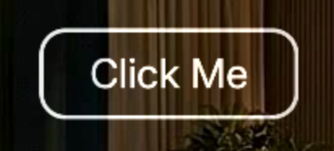

Button with custom size:
```python
button = Button(center_text="Click Me", width=150, height=60)
```

Button with custom colors and styling:
```python
button = Button(center_text="Click Me", background_color="#FF0000", corner_radius=10)
```


Button with icon:
```python
button = Button(
    center_text="Click Me",
    icon_path="assets/icon.png",
)
```

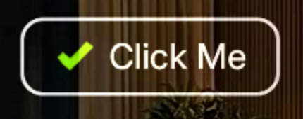

Button with action icon:
```python
button = Button(
    center_text="Click Me",
    show_action_icon=True,
    width=400,
)
```

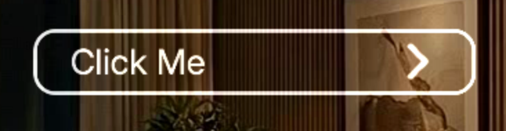

Button with icon and action icon:
```python
button = Button(
    center_text="Click Me",
    icon_path="assets/icon.png",
    show_action_icon=True,
    width=400,
)
```

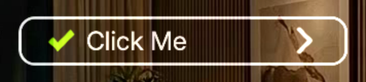

Button click handlers:

Simple button with click handler (no params):
```python
self.button = Button(center_text="Click Me")
self.button.on_clicked(self.on_button_click)

def on_button_click(self):
    self.button.set_text("Clicked!")
```

Button with click handler (with params):
```python
self.button = Button(center_text="Click Me")
self.button.on_clicked(self.on_button_click, "New Text")

def on_button_click(self, new_text):
    self.button.set_text(new_text)
```


**Frequently used params:** `width` (int), `height` (int), `background_color` (str, hex code), `text_size` (int), `text_color` (str, hex code), `font_weight` (str), `corner_radius` (int), `outline_width` (int), `outline_color` (str, hex code), `dwell_time` (int), `icon_path` (str), `disabled` (bool)

**Frequently used methods:** `set_text(new_text: str)`, `on_clicked(callback, *args, **kwargs)`, `set_disabled(disabled: bool)`, `set_enabled(enabled: bool)`, `is_disabled() -> bool`

See detailed params and functions in `raven_framework/components/button.py`

#### Icon

A circular or rounded-rect icon with dwell-click interaction and optional background image.

```python
from raven_framework.components.icon import Icon
```

Simple icon:
```python
icon = Icon(background_image_path="icon.png")
```

Icon with custom size (diameter):
```python
icon = Icon(background_image_path="icon.png", size=150)
```


Icon click handlers:

Simple icon with click handler (no params):
```python
self.icon = Icon(size=80)
self.icon.on_clicked(self.on_icon_click)

def on_icon_click(self):
    self.icon.set_text("Clicked!")
```

Icon with click handler (with params):
```python
self.icon = Icon(size=80)
self.icon.on_clicked(self.on_icon_click, "New Text")

def on_icon_click(self, new_text):
    self.icon.set_text(new_text)
```

**Frequently used params:** `background_image_path` (str), `size` (int), `background_color` (str, hex code), `center_text` (str), `text_size` (int), `text_color` (str, hex code), `corner_radius` (int), `outline_width` (int), `outline_color` (str, hex code), `dwell_time` (int), `is_square` (bool), `enable_click` (bool), `bottom_text` (str), `disabled` (bool)

**Frequently used methods:** `set_text(new_text: str)`, `on_clicked(callback, *args, **kwargs)`, `set_background_image(image_path: str)`, `set_disabled(disabled: bool)`, `set_enabled(enabled: bool)`, `is_disabled() -> bool`

See detailed params and functions in `raven_framework/components/icon.py`

#### Spacer

A simple spacer widget for adding empty space in layouts.

```python
from raven_framework.components.spacer import Spacer
```

Vertical spacer:
```python
spacer = Spacer(height=20)
```


Horizontal spacer:
```python
spacer = Spacer(width=50)
```

**Frequently used params:** `width` (int), `height` (int)

See detailed params and functions in `raven_framework/components/spacer.py`

#### Media Viewer

Displays images, GIFs, or videos with rounded corners and playback controls.

```python
from raven_framework.components.media_viewer import MediaViewer
```

Simple media viewer with image:
```python
viewer = MediaViewer(media_path="assets/image.jpg")
```

Simple media viewer with GIF:
```python
viewer = MediaViewer(media_path="assets/animation.gif")
```

Simple media viewer with video:
```python
viewer = MediaViewer(media_path="assets/video.mp4")
```

Media viewer with image, size and corner radius:
```python
viewer = MediaViewer(media_path="assets/image.jpg", width=400, height=400, corner_radius=10)
```

Media viewer with video, looping and controls:
```python
viewer = MediaViewer(media_path="assets/video.mp4", loop_video=True)
viewer.play_video()
viewer.pause_video()
```

**Frequently used params:** `media_path` (str), `corner_radius` (int), `width` (int), `height` (int), `loop_video` (bool)

**Frequently used methods:** `play_video()`, `pause_video()`

See detailed params and functions in `raven_framework/components/media_viewer.py`

#### Web Viewer

Displays web content.

```python
from raven_framework.components.web_viewer import WebViewer
```

Simple web viewer:
```python
web = WebViewer(url="https://example.com")
```

Web viewer with custom size:
```python
web = WebViewer(url="https://example.com", width=300, height=200)
```


**Frequently used params:** `url` (str), `width` (int), `height` (int)

See detailed params and functions in `raven_framework/components/web_viewer.py`

#### Scroll View

A scrollable widget with gaze-based dwell scrolling and auto-scroll support.

```python
from raven_framework.components.scroll_view import ScrollView
```

Scroll view example:
```python
vbox = VerticalContainer(width=480, inner_margin=30)
for i in range(20):
    vbox.add(TextBox(f"This is line {i}."))
scroll = ScrollView(content_widget=vbox, width=480, height=720)
```

Scroll view with continuous scroll:
```python
vbox = VerticalContainer(width=480, inner_margin=30)
for i in range(20):
    vbox.add(TextBox(f"This is line {i}."))
scroll = ScrollView(content_widget=vbox, width=480, height=540, enable_continuous_scroll=True)
```

**Frequently used params:** `content_widget` (QWidget (all ui components)), `width` (int), `height` (int), `enable_continuous_scroll` (bool)

**Frequently used methods:** `scroll_next()`, `scroll_prev()`, `start_auto_scroll`, `stop_auto_scroll()`, `clear()`

See detailed params and functions in `raven_framework/components/scroll_view.py`

### Cards

Reusable card components with various layouts and button configurations.

#### Text Card With Button

Card with text content and a single button.

```python
from raven_framework.cards import TextCardWithButton

card = TextCardWithButton()
```

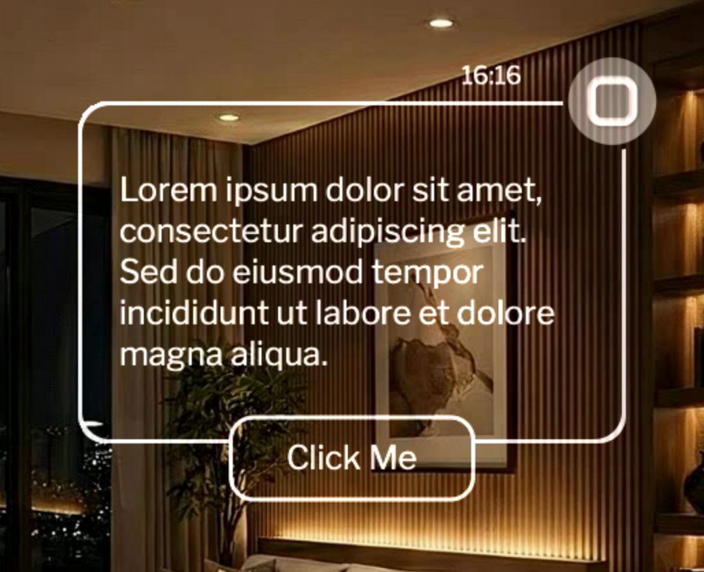

Frequently used params:
- `text` (str): Text content to display
- `container_width` (int): Width of the card container
- `button_text` (str): Text for the button
- `on_button_click` (Callable): Optional callback function for button click

See detailed params and functions in `raven_framework/cards.py`

#### Text Card With Two Buttons

Card with text content and two buttons.

```python
from raven_framework.cards import TextCardWithTwoButtons

card = TextCardWithTwoButtons()
```

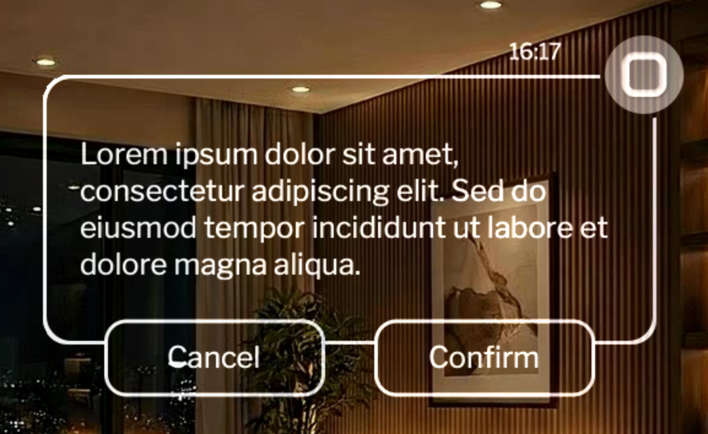

Frequently used params:
- `text` (str): Text content to display
- `container_width` (int): Width of the card container
- `button_text_1` (str): Text for the first button
- `button_text_2` (str): Text for the second button
- `on_button_1_click` (Callable): Optional callback function for first button click
- `on_button_2_click` (Callable): Optional callback function for second button click

See detailed params and functions in `raven_framework/cards.py`

#### Horizontal Text Card With Button

Horizontal card with text and a button.

```python
from raven_framework.cards import HorizontalTextCardWithButton

card = HorizontalTextCardWithButton()
```

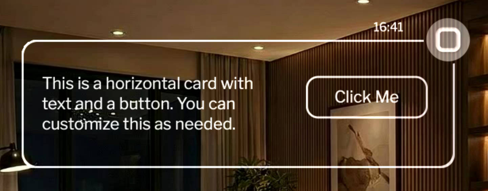

Frequently used params:
- `text` (str): Text content to display
- `container_width` (int): Width of the card container
- `button_text` (str): Text for the button
- `on_button_click` (Callable): Optional callback function for button click

See detailed params and functions in `raven_framework/cards.py`

#### Horizontal Text Card

Horizontal card with text only (no button).

```python
from raven_framework.cards import HorizontalTextCard

card = HorizontalTextCard()
```

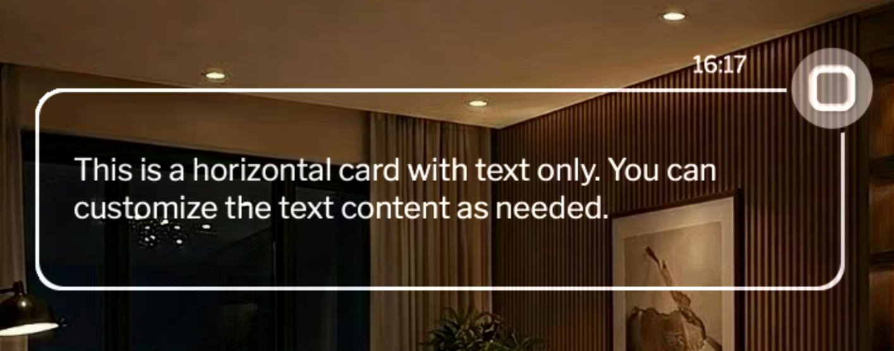

Frequently used params:
- `text` (str): Text content to display
- `container_width` (int): Width of the card container
- `text_alignment` (str): Text alignment

See detailed params and functions in `raven_framework/cards.py`

#### Media Card

Card with media viewer, title, subtitle, and body text (no button).

```python
from raven_framework.cards import MediaCard

card = MediaCard(image_path="assets/image.png")
```

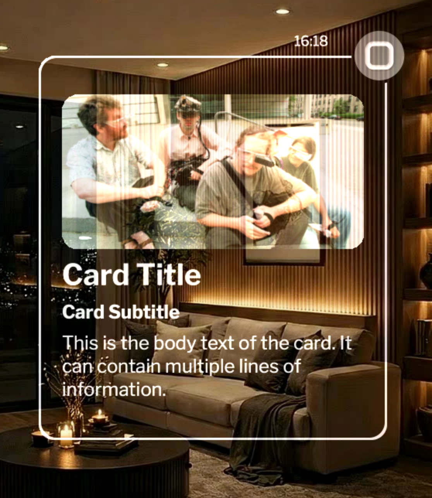

Frequently used params:
- `title_text` (str): Title text
- `subtitle_text` (str): Subtitle text
- `body_text` (str): Body text
- `image_path` (str): Path to the image
- `image_height` (int): Height of the image
- `container_width` (int): Width of the card container

See detailed params and functions in `raven_framework/cards.py`

#### Media Card With Button

Card with media viewer, title, subtitle, body text, and a single button.

```python
from raven_framework.cards import MediaCardWithButton

card = MediaCardWithButton(image_path="assets/image.png")
```

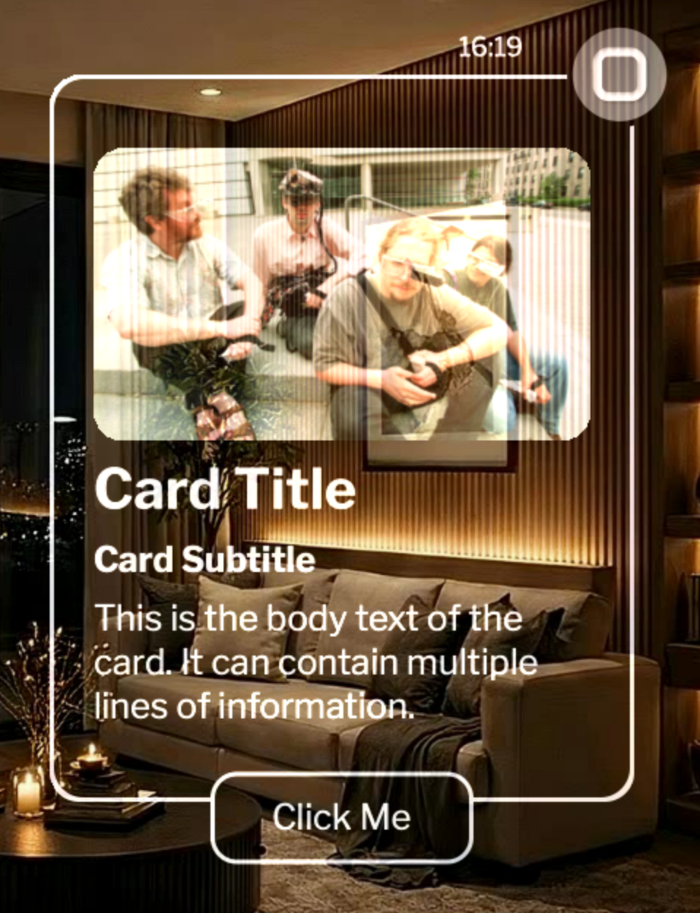

Frequently used params:
- `title_text` (str): Title text
- `subtitle_text` (str): Subtitle text
- `body_text` (str): Body text
- `button_text` (str): Text for the button
- `image_path` (str): Path to the image
- `image_height` (int): Height of the image
- `container_width` (int): Width of the card container
- `on_button_click` (Callable): Optional callback function for button click

See detailed params and functions in `raven_framework/cards.py`

#### Media Card With Two Buttons

Card with media viewer, title, subtitle, body text, and two buttons.

```python
from raven_framework.cards import MediaCardWithTwoButtons

card = MediaCardWithTwoButtons(image_path="assets/image.png")
```

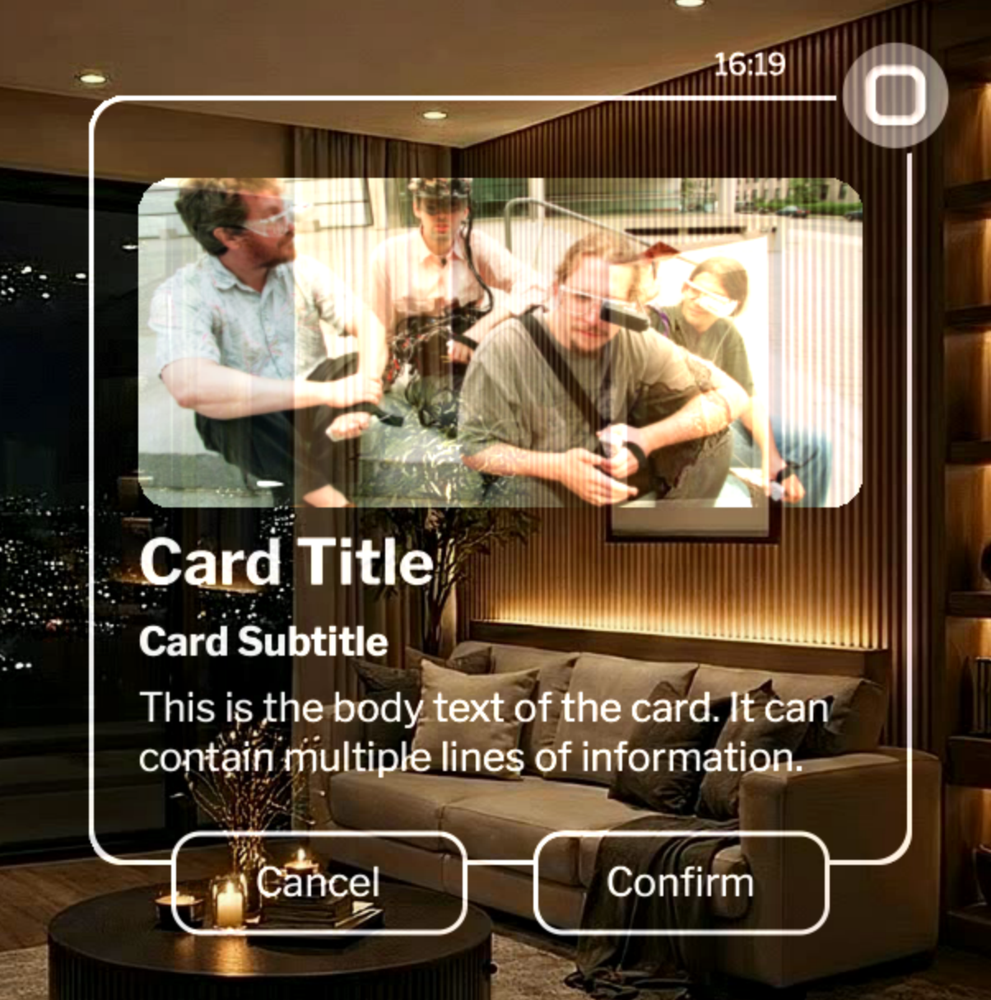

Frequently used params:
- `title_text` (str): Title text
- `subtitle_text` (str): Subtitle text
- `body_text` (str): Body text
- `button_text_1` (str): Text for the first button
- `button_text_2` (str): Text for the second button
- `image_path` (str): Path to the image
- `image_height` (int): Height of the image
- `container_width` (int): Width of the card container
- `on_button_1_click` (Callable): Optional callback function for first button click
- `on_button_2_click` (Callable): Optional callback function for second button click

See detailed params and functions in `raven_framework/cards.py`

#### Scrollable List Card

Card with a scrollable list of items, each with a button.

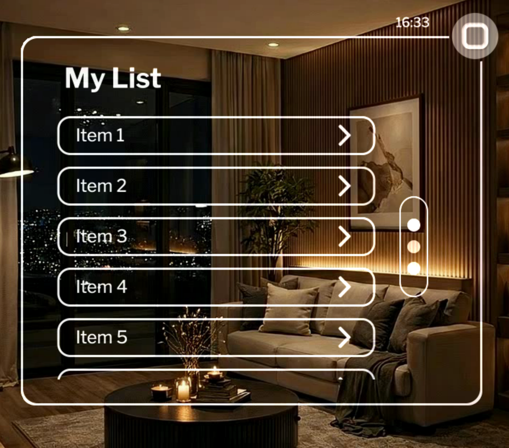

```python
from raven_framework.cards import ScrollableListCard

card = ScrollableListCard()
```

Frequently used params:
- `title_text` (str): Title text
- `info_strings` (List[str]): List of strings to display
- `button_strings` (List[str]): List of button texts
- `card_width` (int): Width of the card container
- `card_height` (int): Height of the card container
- `on_item_click` (List[Tuple[Callable, ...]]): Optional callback for item button clicks

See detailed params and functions in `raven_framework/cards.py`

## Peripherals

**Note:** All sensors require special entitlement from developer site for publishing apps in the future, but not for development apps. All sensors accept optional `app_id` (str) and `app_key` (str) parameters for entitlement verification.

### Camera

Camera sensor for capturing images and video.

```python
from raven_framework.peripherals.camera import Camera

camera = Camera()
```

Open camera:
```python
camera.open_camera()
```

Capture image:
```python
frame = camera.capture_camera_image()
```

Close camera:
```python
camera.close_camera()
```

Frequently used methods:
- `open_camera() -> VideoCapture | None`: Open camera and return VideoCapture object
- `capture_camera_image() -> ndarray | None`: Capture image frame from camera
- `close_camera() -> None`: Close camera connection

See detailed params and functions in `raven_framework/peripherals/camera.py`

### Microphone

Microphone sensor for audio recording with level detection.

```python
from raven_framework.peripherals.microphone import Microphone

mic = Microphone()
```

Start recording:
```python
mic.start_recording()
```

Stop recording:
```python
wav_bytes = mic.stop_recording()
```

Frequently used methods:
- `start_recording() -> None`: Start audio recording
- `stop_recording() -> bytes`: Stop recording and return WAV bytes
- `get_level() -> float`: Get current audio level (0.0 to 1.0)

See detailed params and functions in `raven_framework/peripherals/microphone.py`

### IMU

IMU (Inertial Measurement Unit) sensor for reading accelerometer, gyroscope, and magnetometer data. **Note:** In simulator mode, arrow keys can be used to simulate accelerometer readings (Up/Down for Y-axis, Left/Right for X-axis).

```python
from raven_framework.peripherals.imu import IMU

imu = IMU()
```

Get reading:
```python
reading = imu.get_reading()
if reading:
    accel = reading.get("accelerometer")
    gyro = reading.get("gyroscope")
```

Frequently used methods:
- `get_reading() -> dict | None`: Get IMU reading with accelerometer, gyroscope, and magnetometer data

See detailed params and functions in `raven_framework/peripherals/imu.py`

### Eye Tracker

Eye tracking sensor for gaze position detection. **Note:** Cannot be simulated in simulator mode.

```python
from raven_framework.peripherals.eye_tracker import EyeTracker

tracker = EyeTracker()
```

Get gaze position:
```python
position = tracker.get_gaze_position()
if position:
    x, y = position
```

Frequently used methods:
- `get_gaze_position() -> Tuple[int, int] | None`: Get current gaze position as (x, y) coordinates

See detailed params and functions in `raven_framework/peripherals/eye_tracker.py`

### Speaker

Speaker for asynchronous playback of WAV audio bytes.

**Note:** In simulator mode, audio playback requires the `audio-simulator` optional dependency. Install it with `pip install -e .[audio-simulator]` or `pip install simpleaudio`. Note that `simpleaudio` may not have pre-built binaries available for all Linux and Windows systems, which can cause installation to fail. If `simpleaudio` is not available, the framework will log a warning and audio playback will not work in simulator mode (but will still work on Raven devices).

```python
from raven_framework.peripherals.speaker import Speaker

speaker = Speaker()
```

Play audio:
```python
speaker.play_audio(wav_bytes, on_finished=callback)
```

Stop audio:
```python
speaker.stop_audio()
```

Frequently used methods:
- `play_audio(wav_bytes: bytes, on_finished: Callable | None = None) -> None`: Play WAV audio bytes asynchronously
- `stop_audio() -> None`: Stop audio playback

See detailed params and functions in `raven_framework/peripherals/speaker.py`

### Click Button

Physical button sensor for reading button state and waiting for button presses. **Note:** Cannot be simulated in simulator mode.

```python
from raven_framework.peripherals.click_button import ClickButton

button = ClickButton()
```

Check if pressed:
```python
if button.is_pressed():
    print("Button is pressed")
```

Wait for press:
```python
pressed = button.wait_for_press(timeout=5.0)
```

Frequently used methods:
- `is_pressed() -> bool`: Check if button is currently pressed
- `wait_for_press(timeout: float = 5.0) -> bool`: Wait for button press with timeout

See detailed params and functions in `raven_framework/peripherals/click_button.py`


## Helpers


### Routine

Timer-based task execution for periodic or delayed execution.

```python
from raven_framework.helpers.routine import Routine
```

Delay routine:
```python
self.delay = Routine(interval_ms=5000, invoke=self.on_done, mode="delay")

def on_done(self):
    print("Done")
```

Periodic routine:
```python
self.routine = Routine(interval_ms=1000, invoke=self.on_tick, mode="repeat")

def on_tick(self):
    print("Tick")
```

Stop routine:
```python
self.routine.stop()
```

Frequently used params:
- `interval_ms` (int): Time interval in milliseconds
- `invoke` (Callable): Function to call on timer timeout
- `mode` (str): "repeat" for periodic calls or "delay" for single shot
- `parent` (QObject): Optional Qt parent object

Frequently used methods:
- `stop() -> None`: Stop the routine timer

See detailed params and functions in `raven_framework/helpers/routine.py`

### Animation Utilities

Simple animation utility functions for fading widgets in and out. **Note:** Call these functions at the end of `__init__` for best results.

```python
from raven_framework.helpers.animation_utils import fade_in, fade_out
```

Fade in:
```python
fade_in(my_widget)
```

Fade out:
```python
fade_out(my_widget)
```

Fade in with custom parameters:
```python
fade_in(my_widget, duration=750)
```

Frequently used params:
- `widget` (QWidget (all UI components)): The widget to animate
- `start_value` (float): Starting opacity (0.0 to 1.0)
- `end_value` (float): Ending opacity (0.0 to 1.0)
- `duration` (int): Animation duration in milliseconds

Frequently used methods:
- `fade_in(widget: QWidget (all UI components), start_value: float = 0.0, end_value: float = 1.0, duration: int = 750) -> None`: Fade in a widget from transparent to opaque
- `fade_out(widget: QWidget (all UI components), start_value: float = 1.0, end_value: float = 0.0, duration: int = 750) -> None`: Fade out a widget from opaque to transparent

See detailed params and functions in `raven_framework/helpers/animation_utils.py`

### Async Runner

Asynchronous task runner using Qt's thread pool.

```python
from raven_framework.helpers.async_runner import AsyncRunner

runner = AsyncRunner()
```

Run task:
```python
runner.run(long_task, on_complete=callback)
```

Frequently used methods:
- `run(func: Callable, on_complete: Callable | None = None) -> None`: Execute a function asynchronously in a background thread

See detailed params and functions in `raven_framework/helpers/async_runner.py`


### Open AI Helper

Helper class for OpenAI API integration.

```python
from raven_framework.helpers.open_ai_helper import OpenAiHelper

ai = OpenAiHelper(open_ai_key="my_open_ai_key")
```

Get text response:
```python
response = ai.get_text_response("Hello, how are you?")
```

Transcribe audio:
```python
text = ai.transcribe_audio(wav_bytes)
```

Get image response:
```python
response = ai.process_multimodal_with_image("What's in this image?", image_frame)
```

Text to speech:
```python
audio_bytes = ai.generate_tts("Hello world", voice="alloy")
```

Using with Camera:
```python
from raven_framework.peripherals.camera import Camera
from raven_framework.helpers.open_ai_helper import OpenAiHelper

camera = Camera()
camera.open_camera()
frame = camera.capture_camera_image()
camera.close_camera()

ai = OpenAiHelper(open_ai_key="my_open_ai_key")
response = ai.process_multimodal_with_image("What's in this image?", frame)
```

Using with Microphone and TextBox:
```python
from raven_framework.peripherals.microphone import Microphone
from raven_framework.components.text_box import TextBox
from raven_framework.helpers.open_ai_helper import OpenAiHelper

mic = Microphone()
mic.start_recording()
# ... wait for recording ...
wav_bytes = mic.stop_recording()

ai = OpenAiHelper(open_ai_key="my_open_ai_key")
transcription = ai.transcribe_audio(wav_bytes)
response = ai.get_text_response(f"Respond to this: {transcription}")

text_box = TextBox(text=response)
```

Using with Speaker:
```python
from raven_framework.peripherals.speaker import Speaker
from raven_framework.helpers.open_ai_helper import OpenAiHelper

ai = OpenAiHelper(open_ai_key="my_open_ai_key")
audio_bytes = ai.generate_tts("Hello, this is a test", voice="alloy")

speaker = Speaker()
speaker.play_audio(audio_bytes)
```

Frequently used params:
- `open_ai_key` (str): API key for OpenAI

Frequently used methods:
- `transcribe_audio(wav_bytes: bytes, model: str = "whisper-1", audio_filename: str = "audio.wav", audio_mime_type: str = "audio/wav") -> str`: Transcribe audio bytes using Whisper model
- `get_text_response(prompt: str, model: str = "gpt-4o") -> str`: Get a text completion from GPT based on a prompt
- `process_multimodal_with_image(prompt: str, image: ndarray, model: str = "gpt-4o") -> str`: Send a multimodal prompt including text and an image to GPT
- `generate_tts(text: str, model: str = "tts-1", voice: str = "alloy", response_format: str = "wav") -> bytes`: Generate speech audio from text using TTS model

See detailed params and functions in `raven_framework/helpers/open_ai_helper.py`

## Designing for Raven OS

Raven OS is built for display glasses that prioritize **comfort, presence, and real world awareness**. It supports the user without replacing their environment, using calm, peripheral, and intentional UI.

These guidelines outline how to design interfaces that feel natural, unobtrusive, and aligned with Raven's optical and interaction constraints.

> **Note:** This is very early stage, and we are continuously researching as hardware gets into more people's hands. We strongly suggest using our framework items like buttons and scroll bars, as we plan on updating them based on user feedback and research findings.

### 1. Comfort & Presence

Raven OS exists to bring users **back to the real world**.

* UI should feel ambient, optional, and calm
* Urgency should be rare and intentional
* Reduce eye strain and cognitive load

> If the UI feels distracting, it's failing.

Design for the **periphery by default**. Move content to central focus only when the user intentionally engages.

### 2. Display, Color & Typography

#### Display

* **Resolution:** 720 × 720 LCOS
* **Field of View:** 30° diagonal
* **Offset:** Right‑side

The right‑side offset reduces distraction, preserves central vision, and improves long‑term comfort. Designs should assume **asymmetry** and avoid centering UI for visual balance alone.

#### Color & Waveguide

Raven uses a **waveguide-based additive display**. Additive blending means that light from the display is added to the light from the real world. The waveguide projects light into the user's eye, which combines with ambient light from the environment.  This means:

* Light from the display adds to real-world light (additive blending)
* Bright, saturated colors may bloom or appear more intense than on traditional displays
* Dark backgrounds with white or light gray text provide better contrast and readability
* Use accent colors sparingly to avoid visual fatigue
* Never rely on color alone for meaning
* Black gets completely vanished no matter what — pure black cannot be displayed on an additive display
  * Though you can use it for occlusion and showing depth. For example, the background of buttons by default is black so it occludes the content behind it
* White will look best unless seen on top of white background — white text/UI elements work well against dark backgrounds
* All of this is dependent on display brightness

> **Note:** Additive display behavior and color rendering are very complex topics. This is a simplified explanation to help guide design decisions. Actual color appearance depends on many factors including ambient lighting, display brightness, waveguide properties, and user perception.

The desktop simulator approximates how colors will appear on the actual waveguide display, making it useful for color testing during development.

#### Typography

Raven provides an optimized system font scale. We suggest a visual angle range of **0.8° to 1.2°**, and **Title, Headline, and Body** fall within this range.

For Raven Glass (720×720 px display with 30° diagonal FOV), these translate to the following pixel values:

* **Title** - 38px (1.12° visual angle)
* **Headline** - 33px (0.97° visual angle)
* **Body** - 28px (0.83° visual angle)

Use these only if absolutely necessary:
* **Display** - 45px (1.33° visual angle) - use sparingly
* **Small** - 18px (0.53° visual angle) - use sparingly

Rules:

* Prefer using system fonts only
* Avoid custom fonts, especially on buttons
* Use Display and Small fonts only when necessary
* Don't stack multiple text sizes in tight areas

See [Text Box](#text-box) for how to use these font types in your application.

### 3. Layout & Spatial Model

Layout is based on **attention**, not symmetry.

#### Central vs Peripheral Zones

**Central**

* Reading and focus‑heavy content

**Peripheral**

* Persistent background content (recipes, directions, reference content)
* Buttons and interactive controls
* Elements not triggered by users, such as notifications
* Elements that remain visible without demanding focus

Guidelines:

* Place interactive elements primarily on the **right side**
* Avoid controls in primary reading areas
* Assume accidental gaze is common
* Users tend to look at bottom center most frequently. For rarely clicked items or critical actions (like going to home, scroll pagination) that need to be interacted with very intentionally, place them in the top right or right periphery to avoid accidental activation

### 4. Input, Eye Tracking & Content Flow

#### Eye Tracking

Eye tracking is the default mode of interaction for Raven Glass. It provides around ~2–3° accuracy (subject to change as hardware testing progresses). Use large targets, avoid dense layouts, and rely on framework‑provided controls.

#### Interaction

Raven OS focuses on hands‑free input methods. For pointing, smooth gaze is used and interactive elements like [buttons](#button) and [icons](#icon) scale. For clicking, we are prioritizing multiple methods.

This is how buttons work in the framework:

* **Dwell‑to‑click** (default) — gaze at a button for a set duration to activate
* **Double‑blink** (default, evolving) — double blink to activate focused elements

For getting long responses, you can use voice input with the [microphone](#microphone). Future input solutions are being explored for typing on Raven Glass.

As a Linux‑based system, Raven supports third‑party Bluetooth HID devices (mouse, keyboard, rings, bands, accessibility tools). Interfaces must remain input‑agnostic.

#### Scrolling & Content Flow

Traditional scrolling is discouraged due to eye fatigue and attention shifts, though it may sometimes be needed (for example, in a news app with multiple headlines to quickly glance at). Use [scroll view](#scroll-view) when scrolling is necessary.

Raven supports pagination and continuous scrolling, but **pagination is recommended**. It minimizes eye movement and interaction cost. Auto‑scroll may work for passive content, but requires visual tracking and can reduce comfort.

## Examples

For complete, ready-to-run example applications, check out the [Raven Starter Projects](https://github.com/RavenResonance/raven-starter-project) repository.

The starter projects include:

- **Hello World** - A simple app displaying "Hello, World!" text
- **Counter** - A stopwatch app with start, pause, resume, and reset functionality using cards and routines
- **Simple AI App** - An AI-powered app that uses camera, microphone, and speaker with OpenAI integration
- **Art Studio** - A painting reference viewer app with scrollable list and media viewer

All examples include full source code and can be run immediately after installing the framework.

## Building Apps with AI

The Raven Framework repository includes an `AGENTS.md` file that contains condensed documentation optimized for AI assistants. Coding tools like Cursor and Copilot should automatically see this as a README and use it for context. You can also copy this file and provide it to AI assistants (like ChatGPT, Claude, or Gemini) to help you build Raven applications. The AI will have all the framework information it needs to generate code and answer questions about components, sensors, and utilities. [Learn more about AGENTS.md](https://agents.md/).

## License

This project is proprietary software. The Raven Framework code and documentation are proprietary and may not be redistributed, modified, or used except as expressly permitted by RavenResonance. Do not push the Raven Framework code to public repositories or distribute it without authorization.

